# Meri Aama Database Schema & ER Diagram Specification

This document details the complete database schema of the **Meri Aama** system, summarizing all 20 database tables/models across the various Django apps. It provides a visual **Entity-Relationship (ER) Diagram** and a **Class Diagram** built using Mermaid syntax to help you reconstruct them for documentation or modeling tools.

---

## 1. Entity-Relationship (ER) Diagram

The following diagram defines the physical database structure, demonstrating how tables map, keys link, and cardinality flows.

```mermaid
erDiagram
    User ||--|| HealthProfile : "has"
    User ||--|| TrimesterNarrativeCache : "has"
    User ||--o{ DailyWellnessLog : "creates"
    User ||--o{ MoodEntry : "logs"
    User ||--o{ PsychometricTest : "takes"
    User ||--o{ Recommendation : "receives"
    User ||--o{ MedicalReport : "uploads"
    User ||--o{ PersonalCheckIn : "writes"
    User ||--o{ DoctorQuestion : "asks"
    User ||--o{ ForumPost : "authors"
    User ||--o{ ForumComment : "authors"
    User ||--o{ PrenatalVisit : "attends (mother)"
    User ||--o{ PrenatalVisit : "inputs (staff)"
    User ||--o{ Medication : "prescribed (mother)"
    User ||--o{ Medication : "writes (prescriber)"
    
    User ||--o{ DoctorAssignment : "assigned_as_mother"
    User ||--o{ DoctorAssignment : "assigned_as_doctor"
    User ||--o{ DoctorAssignment : "makes_assignment"
    DoctorAssignment ||--o{ ChatMessage : "has"
    User ||--o{ ChatMessage : "sends"

    PrenatalVisit ||--o{ Medication : "linked_in"
    Medication ||--o{ MedicationLog : "tracked_by"
    ForumPost ||--o{ ForumComment : "has"

    DailyWellnessLog }o--o{ WellnessTip : "contains_nutrition"
    DailyWellnessLog }o--o{ WellnessTip : "contains_mental"
    DailyWellnessLog }o--o{ WellnessTip : "contains_exercise"
    DailyWellnessLog }o--o{ WellnessTip : "contains_precaution"

    User {
        int id PK
        string username
        string password
        string email
        string role "mother | doctor | data_entry | admin"
        string phone_number
        string preferred_language
    }

    HealthProfile {
        int id PK
        int user_id FK
        date last_menstrual_period
        date expected_delivery_date
        bool edd_is_manual_override
        int current_gestational_week
        int latest_mood_score
        string latest_stress_level
        string blood_group
        text pre_existing_conditions
        json allergies
        string allergy_other
        bool has_gestational_diabetes
        bool has_hypertension
        string dietary_preference
        decimal height_cm
        decimal pre_pregnancy_weight_kg
        int previous_pregnancies_count
        int live_births_count
        json previous_complications
        string previous_complications_other
        bool smokes
        bool drinks_alcohol
    }

    PrenatalVisit {
        int id PK
        int mother_id FK
        int entered_by_id FK
        date visit_date
        int gestational_week
        decimal maternal_weight_kg
        string blood_pressure
        decimal fundal_height_cm
        int fetal_heart_rate_bpm
        string fetal_movement
        string urine_protein
        string urine_glucose
        decimal hemoglobin_g_dl
        string fetal_position
        string edema
        text doctor_notes
        date next_visit_date
    }

    Medication {
        int id PK
        int mother_id FK
        int prescribed_by_id FK
        int visit_id FK
        string name
        string dosage
        string medication_type
        string purpose
        string route
        int frequency_per_day
        string medicine_time
        time reminder_time
        string food_instruction
        int duration_days
        date start_date
        text notes
    }

    MedicationLog {
        int id PK
        int medication_id FK
        date date
        datetime logged_at
    }

    DoctorAssignment {
        int id PK
        int mother_id FK
        int doctor_id FK
        int assigned_by_id FK
        bool is_active
        datetime assigned_at
    }

    ChatMessage {
        int id PK
        int assignment_id FK
        int sender_id FK
        text text
        bool is_read
        datetime created_at
    }

    PersonalCheckIn {
        int id PK
        int user_id FK
        text note
        string image
        datetime logged_at
    }

    DoctorQuestion {
        int id PK
        int user_id FK
        string question
        bool is_answered
        datetime created_at
    }

    MoodEntry {
        int id PK
        int user_id FK
        int score
        json tags
        string note
        datetime logged_at
    }

    PsychometricTest {
        int id PK
        int user_id FK
        string test_type
        json answers
        int total_score
        string risk_level
        datetime taken_at
    }

    TrimesterNarrativeCache {
        int id PK
        int user_id FK
        int visit_count_at_generation
        text narrative_text
        json narrative_json
        datetime generated_at
    }

    DailyWellnessLog {
        int id PK
        int user_id FK
        date date
        text personalized_text
    }

    WellnessTip {
        int id PK
        string code
        string category
        string trimester
        text text
        string source_name
        json avoid_if_allergic_to
        json avoid_if_condition
        json avoid_if_diet
        json only_if_condition
        bool is_active
    }

    Recommendation {
        int id PK
        int user_id FK
        text query
        json retrieved_sources
        text response_text
        json structured_response
        json safety_flags
    }

    MedicalReport {
        int id PK
        int user_id FK
        string file
        string status
        text summary_text
        json flagged_values
    }

    ForumPost {
        int id PK
        int author_id FK
        string stage
        string title
        text body
        string image
        bool is_approved
        datetime created_at
    }

    ForumComment {
        int id PK
        int post_id FK
        int author_id FK
        text body
        datetime created_at
    }
```

---

## 2. Logical Class Diagram

The class diagram exposes Django model structures, helper properties, choices, methods, and relationship attributes.

```mermaid
classDiagram
    class User {
        +Role role
        +CharField phone_number
        +CharField preferred_language
        +is_hospital_staff() bool
        +can_manage_staff() bool
        +is_hospital_admin() bool
    }

    class HealthProfile {
        +last_menstrual_period date
        +expected_delivery_date date
        +edd_is_manual_override bool
        +current_gestational_week int
        +latest_mood_score int
        +latest_stress_level str
        +blood_group str
        +pre_existing_conditions text
        +allergies json
        +allergy_other str
        +has_gestational_diabetes bool
        +has_hypertension bool
        +dietary_preference str
        +height_cm decimal
        +pre_pregnancy_weight_kg decimal
        +previous_pregnancies_count int
        +live_births_count int
        +previous_complications json
        +previous_complications_other str
        +smokes bool
        +drinks_alcohol bool
        +recalculate_derived_dates() void
        +weeks_until_due int
        +is_first_pregnancy bool
        +pre_pregnancy_bmi decimal
        +recommended_weight_gain_range_kg tuple
    }

    class PrenatalVisit {
        +FetalMovement fetal_movement
        +UrineLevel urine_protein
        +UrineLevel urine_glucose
        +FetalPosition fetal_position
        +Edema edema
        +date visit_date
        +int gestational_week
        +decimal maternal_weight_kg
        +str blood_pressure
        +decimal fundal_height_cm
        +int fetal_heart_rate_bpm
        +text doctor_notes
        +date next_visit_date
        +save() void
    }

    class Medication {
        +MedicationType medication_type
        +Route route
        +Time medicine_time
        +FoodInstruction food_instruction
        +str name
        +str dosage
        +str purpose
        +int frequency_per_day
        +time reminder_time
        +int duration_days
        +date start_date
        +text notes
        +end_date date
        +is_active bool
        +days_remaining int
        +day_number int
        +expected_doses_so_far int
        +total_expected_doses int
        +taken_doses_count int
        +missed_doses int
        +adherence_percent int
        +status str
    }

    class MedicationLog {
        +date date
        +datetime logged_at
    }

    class DoctorAssignment {
        +ForeignKey mother
        +ForeignKey doctor
        +ForeignKey assigned_by
        +bool is_active
        +datetime assigned_at
    }

    class ChatMessage {
        +ForeignKey assignment
        +ForeignKey sender
        +text text
        +bool is_read
        +datetime created_at
    }

    class PersonalCheckIn {
        +text note
        +ImageField image
        +datetime logged_at
    }

    class DoctorQuestion {
        +str question
        +bool is_answered
        +datetime created_at
    }

    class WeeklyBabyFact {
        +int start_week
        +int end_week
        +int trimester
        +str title
        +str size_comparison
        +decimal average_length_cm
        +int average_weight_g
        +str image_name
        +json baby_development
        +json mother_changes
        +json warning_signs
        +text nutrition_tip
        +text exercise_tip
        +str weekly_milestone
        +text fun_fact
        +bool is_active
    }

    class MoodEntry {
        +int score
        +json tags
        +str note
        +datetime logged_at
        +save() void
        +tag_labels() list
    }

    class PsychometricTest {
        +TestType test_type
        +RiskLevel risk_level
        +json answers
        +int total_score
        +datetime taken_at
        +compute_risk_level() str
        +save() void
    }

    class TrimesterNarrativeCache {
        +int visit_count_at_generation
        +text narrative_text
        +json narrative_json
        +datetime generated_at
    }

    class DailyWellnessLog {
        +date date
        +text personalized_text
    }

    class WellnessTip {
        +Category category
        +Trimester trimester
        +str code
        +text text
        +str source_name
        +json avoid_if_allergic_to
        +json avoid_if_condition
        +json avoid_if_diet
        +json only_if_condition
        +bool is_active
    }

    class Recommendation {
        +str query
        +json retrieved_sources
        +str response_text
        +json structured_response
        +json safety_flags
    }

    class MedicalReport {
        +Status status
        +FileField file
        +text summary_text
        +json flagged_values
    }

    class ForumPost {
        +Stage stage
        +str title
        +text body
        +ImageField image
        +bool is_approved
        +datetime created_at
    }

    class ForumComment {
        +text body
        +datetime created_at
    }

    User "1" *-- "1" HealthProfile : user
    User "1" *-- "1" TrimesterNarrativeCache : user
    User "1" *-- "*" DailyWellnessLog : user
    User "1" *-- "*" MoodEntry : user
    User "1" *-- "*" PsychometricTest : user
    User "1" *-- "*" Recommendation : user
    User "1" *-- "*" MedicalReport : user
    User "1" *-- "*" PersonalCheckIn : user
    User "1" *-- "*" DoctorQuestion : user
    User "1" *-- "*" ForumPost : author
    User "1" *-- "*" ForumComment : author
    User "1" *-- "*" PrenatalVisit : mother
    User "1" *-- "*" PrenatalVisit : entered_by
    User "1" *-- "*" Medication : mother
    User "1" *-- "*" Medication : prescribed_by
    User "1" *-- "*" DoctorAssignment : doctor_assignments (mother)
    User "1" *-- "*" DoctorAssignment : assigned_mothers (doctor)
    User "1" *-- "*" DoctorAssignment : assignments_made (assigned_by)
    User "1" *-- "*" ChatMessage : messages_sent (sender)

    PrenatalVisit "1" *-- "*" Medication : visit
    Medication "1" *-- "*" MedicationLog : medication
    ForumPost "1" *-- "*" ForumComment : post
    DoctorAssignment "1" *-- "*" ChatMessage : assignment

    DailyWellnessLog "*" *-- "*" WellnessTip : nutrition_tips
    DailyWellnessLog "*" *-- "*" WellnessTip : mental_health_tips
    DailyWellnessLog "*" *-- "*" WellnessTip : exercise_tips
    DailyWellnessLog "*" *-- "*" WellnessTip : precaution_tips
```

---

## 3. Data Dictionary (Detailed Models)

Below is the directory mapping of the data models and their purpose.

### 🔑 Accounts (`accounts`)
* **File Location**: [models.py](file:///d:/meriaama/apps/accounts/models.py)
* **`User` Model**:
  - `role`: Choiced CharField (`mother`, `doctor`, `data_entry`, `admin`). Controls dashboard redirections and API permission decorators.
  - `phone_number`: CharField for notifications or contact.
  - `preferred_language`: English (`en`) or Nepali (`ne`).

### 🩺 Health Profile (`health_profile`)
* **File Location**: [models.py](file:///d:/meriaama/apps/health_profile/models.py)
* **`HealthProfile` Model**:
  - Tracks calculation anchors (`last_menstrual_period`, `expected_delivery_date`).
  - Holds boolean states (`has_gestational_diabetes`, `has_hypertension`) and profile metadata (`pre_pregnancy_weight_kg`, `height_cm`) to calculate BMI and track recommendations.
  - Dictates allergy filtering via `allergies` JSON array (nut/dairy/gluten etc.) and `dietary_preference`.

### 🏥 Hospital Portal (`hospital_portal`)
* **File Location**: [models.py](file:///d:/meriaama/apps/hospital_portal/models.py)
* **`PrenatalVisit` Model**:
  - Main record for clinic visits.
  - Fields map directly to clinical metrics: maternal weight, blood pressure ("120/80"), fundal height, fetal heart rate, fetal movement status, urine protein, urine glucose, hemoglobin concentration, fetal position, and edema levels.
* **`Medication` Model**:
  - Prescription records with dosage, frequency, start date, route, reminder times, and food instructions.
  - Features logical properties (`adherence_percent`, `status`, `missed_doses`) which are calculated dynamically against the date range.

### 💬 Doctor Chat (`doctor_chat`)
* **File Location**: [models.py](file:///d:/meriaama/apps/doctor_chat/models.py)
* **`DoctorAssignment` Model**:
  - Links one mother to one doctor for chat.
  - Asserts that only one active assignment exists per mother at a time.
  - Retains assignment history when updated.
* **`ChatMessage` Model**:
  - Stores message content, timestamp, sender, and read status linked to an assignment.

### 📅 Weekly Tracker (`tracker`)
* **File Location**: [models.py](file:///d:/meriaama/apps/tracker/models.py)
* **`PersonalCheckIn` Model**: Private diary logs with markdown text notes and image files.
* **`MedicationLog` Model**: One entry per dosage event logged by the mother, linked directly to the physician's prescription.
* **`DoctorQuestion` Model**: Running checklist of private questions for upcoming prenatal visits.
* **`WeeklyBabyFact` Model**: Seeded developmental resources mapped by gestational week bands (`start_week`, `end_week`).

### 🧠 Psychometric Test (`psychometric`)
* **File Location**: [models.py](file:///d:/meriaama/apps/psychometric/models.py)
* **`PsychometricTest` Model**:
  - Represents answers to EPDS, PSS-10, or GAD-7 screening questionnaires.
  - Stores answers as a JSON array of item scores (e.g. `[1, 0, 2, ...]`).
  - Automatically calculates sum totals and classifies them into `low`/`moderate`/`high` risk on save, while updating the patient's main health profile.

### 💭 Mood (`mood`)
* **File Location**: [models.py](file:///d:/meriaama/apps/mood/models.py)
* **`MoodEntry` Model**:
  - Numerical index (1 to 5) expressing current mood state.
  - Stores symptom tags (e.g. `["tired", "nauseous", "anxious"]`) and text comments.

### 📈 Trimester Analysis (`trimester_analysis`)
* **File Location**: [models.py](file:///d:/meriaama/apps/trimester_analysis/models.py)
* **`TrimesterNarrativeCache` Model**:
  - Caches LLM-generated summaries and advice maps based on total checkup logs to optimize API latency.

### 🥬 Daily Wellness (`daily_wellness`)
* **File Location**: [models.py](file:///d:/meriaama/apps/daily_wellness/models.py)
* **`WellnessTip` Model**:
  - Categorized wellness suggestions.
  - Uses tagging vectors (`avoid_if_allergic_to`, `avoid_if_condition`, `avoid_if_diet`, `only_if_condition`) to perform deterministic safety screening in Python before rendering.
* **`DailyWellnessLog` Model**:
  - Combines wellness tip recommendations for a given calendar day with the personalized text generated by the AI rephraser.

### 🤖 Wellness RAG (`wellness_rag`)
* **File Location**: [models.py](file:///d:/meriaama/apps/wellness_rag/models.py)
* **`Recommendation` Model**:
  - Query logs that capture the original input query, retrieved text excerpts, generated clinical replies, and the safety flag array.

### 📄 PDF Insight (`pdf_insight`)
* **File Location**: [models.py](file:///d:/meriaama/apps/pdf_insight/models.py)
* **`MedicalReport` Model**:
  - Tracks parsed lab report PDF files, processing status, AI plain-language summaries, and lists of out-of-range clinical flags.

### 📢 Insights (`insights`)
* **File Location**: [models.py](file:///d:/meriaama/apps/insights/models.py)
* **`InsightSuggestion` Model**:
  - Preserved banner templates and link mappings triggered by rule-based alert systems (e.g. mood drop warnings or missing stress screenings).

### 💬 Forum (`forum`)
* **File Location**: [models.py](file:///d:/meriaama/apps/forum/models.py)
* **`ForumPost` Model**: Message body, author, categorization, status approval flag, and attached images.
* **`ForumComment` Model**: User comments linked to a specific post.
